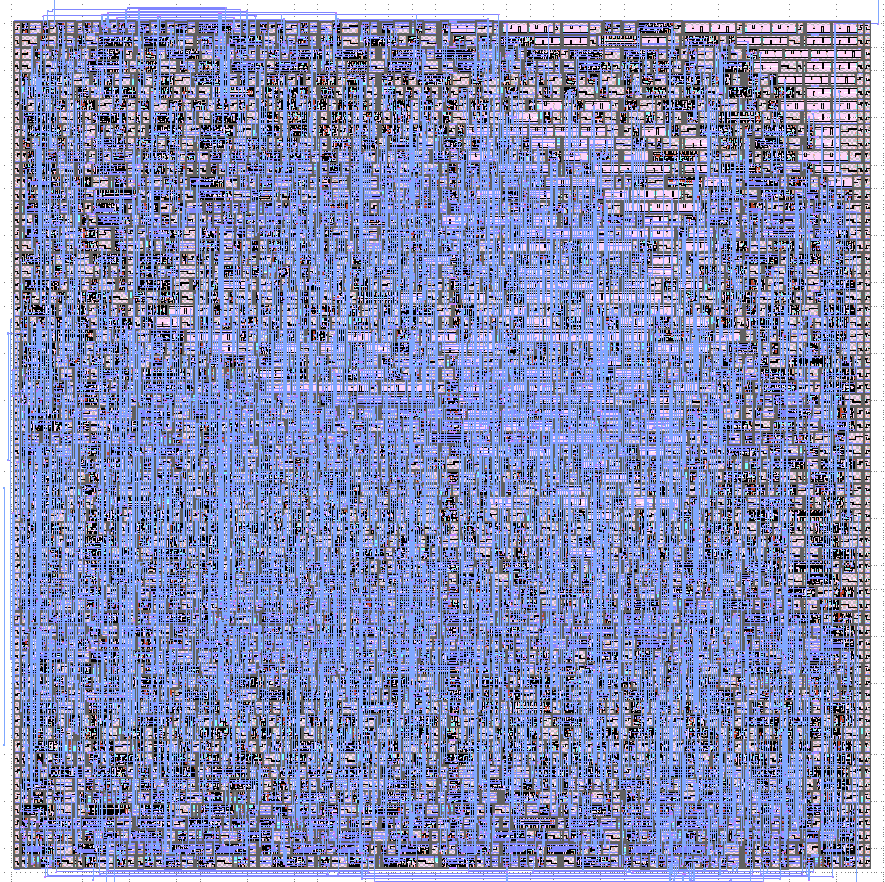

# Wrapped MBS FSK

This project was created as part of the Zero To ASIC course.

The project generates pseudo-random bit sequences for a low power wireless uplink. 

# Zero to ASIC Course

This project was made as part of the [Zero to ASIC Course](https://zerotoasiccourse.com)!

# License

This project is [licensed under Apache 2](LICENSE)
